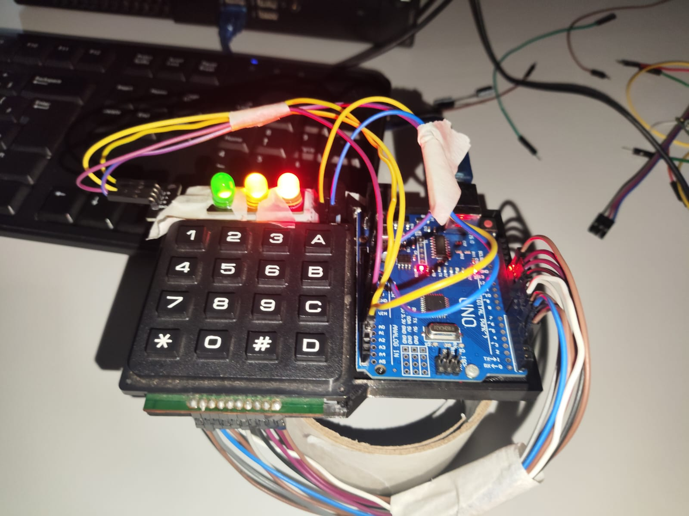
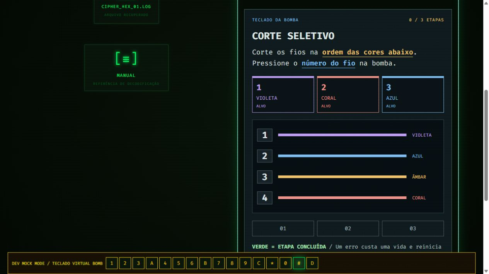

# Desarmar a Bomba

Jogo de enigmas com interface CRT e controles em um Arduino Uno. O dispositivo é exclusivamente cenográfico, sem explosivos. A partida só começa após a conexão e a validação do Arduino.

## Imagens do projeto

**Protótipo físico.** Arduino Uno, teclado 4×4 e três LEDs montados para o jogo.



**Minijogo: corte seletivo.** O painel mostra a ordem das cores; a resposta é dada no teclado físico.



**Módulo concluído.** A interface confirma o acerto antes de abrir o próximo arquivo.


O [esquema elétrico de referência](wiring-reference.png) aparece na seção [Montagem elétrica](#montagem-elétrica). **A pinagem desenhada nessa imagem difere da pinagem do firmware atual.** Confira a tabela antes de ligar os componentes.

## Executar

Requisitos: Node.js 22, Chrome ou Edge para desktop, Arduino Uno e cabo USB de dados. Para jogar com o hardware, carregue primeiro o firmware descrito em [Conectar Arduino](#conectar-arduino).

```powershell
npm install
npm run dev
```

Abra o endereço mostrado pelo Vite. Para gerar a versão de produção: `npm run build`. Sirva a pasta `dist` via HTTPS ou localhost. Web Serial depende de contexto seguro.

## Conectar Arduino

1. Abra `arduino/bomb_controller/bomb_controller.ino` no Arduino IDE.
2. Selecione Arduino Uno e a porta correta. Faça upload. Não são necessárias bibliotecas adicionais.
3. Feche o monitor serial, pois ele ocupa a porta.
4. Na aplicação, clique em CONECTAR DISPOSITIVO e selecione a porta COM do Arduino.
5. O site abre a porta em 115200 baud, aguarda `READY|BOMB_V1`, envia `RESET` e aguarda `ACK|RESET`.
6. Somente após essa confirmação INICIAR JOGO fica disponível.

A janela que lista portas COM pertence ao navegador. A Web Serial não permite alterar sua aparência, selecionar silenciosamente uma porta ou substituir a permissão por um modal próprio. O site estiliza a preparação, o progresso e os erros ao redor dessa janela.

## Montagem elétrica

Componentes: Arduino Uno, teclado matricial 4×4, três LEDs (vermelho, amarelo e verde), três resistores limitadores de corrente adequados aos LEDs, buzzer e cabo USB de dados.

**Esquema fornecido com o projeto:**


> **Atenção à pinagem:** a imagem mostra a disposição dos componentes, mas liga LEDs e teclado a pinos diferentes dos definidos em `arduino/bomb_controller/bomb_controller.ino`. Para usar o firmware deste repositório sem alterá-lo, **siga a tabela abaixo para cada fio**, não os pinos desenhados na imagem.

### Pinagem do firmware atual

| Pinos | Componente |
|---|---|
| D7, D8, D9, D10 | Linhas 1, 2, 3 e 4 do teclado, nessa ordem |
| D3, D4, D5, D6 | Colunas 1, 2, 3 e 4 do teclado, nessa ordem |
| A0 | LED amarelo |
| A1 | LED verde |
| A2 | LED vermelho |
| A3 | Buzzer |

Para cada LED, ligue a saída indicada, o LED e um resistor limitador em série até GND, respeitando a polaridade. Ligue o positivo do buzzer a A3 e o negativo a GND. O teclado usa apenas as oito conexões de linhas e colunas da tabela; a ordem física dos terminais varia conforme o modelo. Confira a identificação do seu teclado e, se necessário, ajuste `ROW_PINS` e `COL_PINS` no início do firmware. O mapa de teclas esperado é `123A / 456B / 789C / *0#D`. Não use D0/D1, reservados para a serial USB.

Antes de conectar o USB, confira polaridade, resistores e ausência de curto. O firmware faz debounce e envia um evento por pressionamento.

## Jogar

Selecione 3, 5 ou 7 módulos antes de iniciar (padrão: 5). Os arquivos são escolhidos sem repetir famílias: cores, interruptores binários, discos de cofre, Caesar, espelho, Morse e binário. Cada arquivo traz suas próprias regras; não há manual separado. Digite o código de cinco dígitos na bomba; `*` limpa e `#` envia.

Cada partida seleciona minigames diferentes de um catálogo de sete, incluindo sempre o quick time event:

- Corte seletivo: siga a ordem das cores e pressione os números dos fios.
- Memória de pulsos: observe e repita com A, B, C e D; `#` repete a demonstração antes da primeira resposta.
- Rota do circuito: percorra do INÍCIO ao FIM pelas teclas dos pontos.
- Janela de sincronia (QTE): leia as regras e pressione `#` para começar. Aperte a tecla mostrada quando o marcador estiver na faixa verde. A rodada dura três segundos, com janela de 1,3 segundo; apertar cedo, tarde, a tecla errada ou deixar a rodada expirar custa uma vida. Após um erro, `#` inicia uma nova tentativa; as rodadas de uma tentativa avançam automaticamente.
- Eco invertido: leia e digite os números da direita para a esquerda.
- Carga do reator: resolva as três somas e digite cada resultado.
- Chave de símbolos: use a legenda para converter os alvos em letras.

Cada desafio traz as regras no próprio painel. Cada acerto de módulo mostra um aviso verde, toca uma confirmação e envia `EVENT|SUCCESS` para um breve sinal no buzzer e LEDs. Um erro custa uma vida e reinicia o desafio atual. A última tecla correta conclui automaticamente o módulo.

A calculadora do desktop aceita `+`, `-`, `*`, `/`, `mod` (ou `%`), `^`, parênteses, raiz (`sqrt`), `abs`, `ln`, `log`, `sin`, `cos`, `tan`, `floor`, `ceil`, `pi` e `e`. O módulo é positivo: `-3 mod 10 = 7`. Trigonometria usa radianos. O teclado do computador controla apenas a calculadora; os minigames seguem recebendo entrada exclusivamente da serial em produção.

As instruções iniciais ficam na tela até o jogador navegar: setas esquerda/direita ou botões VOLTAR/AVANÇAR. Enter pula para o início. O relógio inicia somente após START confirmado pelo Arduino.

Após assegurar todos os módulos, pressione `#` na bomba. O firmware toca uma melodia de oito notas enquanto os LEDs alternam acompanhando as notas, encerrando em silêncio. Reenvie o firmware atualizado ao Arduino para habilitar a melodia e os sinais de acerto.

Três vidas e cinco minutos; o tempo acelera para 1,4x e 1,9x após erros.

Uma desconexão interrompe a partida e congela o relógio. Reconecte e inicie uma nova operação; partidas interrompidas não são retomadas.

## Protocolo

Mensagens UTF-8 terminadas em newline. Arduino para web: `READY|BOMB_V1`, `KEY|<tecla>`, `ACK|RESET`, `ACK|START`, `PONG`. Web para Arduino: `RESET`, `START`, `LIVES|0` até `LIVES|3`, `BUZZ|NORMAL`, `BUZZ|ALERT`, `BUZZ|FAST`, `BUZZ|CRITICAL`, `EVENT|ERROR`, `EVENT|SUCCESS`, `DEFUSED`, `EXPLODE`, `PING`. FAST representa a urgência mínima dos últimos 60 segundos; CRITICAL tem prioridade nos últimos 30 segundos ou com uma vida.

## Desenvolvimento e testes

`npm test` valida 1000 gerações de operações com 3, 5 e 7 enigmas e 1000 conjuntos de minigames, incluindo ordem dos fios, continuidade das rotas, erros imediatos, conclusão e prioridades do buzzer. `npm run build` valida TypeScript e gera os assets.

Modo sem hardware: apenas no servidor de desenvolvimento, abra `http://127.0.0.1:5173/?mock=1`. A faixa DEV MOCK MODE identifica o modo e apresenta as teclas para teste. Essa opção é desativada em builds de produção mesmo com o parâmetro na URL.

Os enigmas estão em `src/game.ts`, as regras físicas em `src/minigames.ts` e os painéis visuais em `src/PhysicalMiniGame.tsx`; a comunicação está em `src/serial.ts`; o som em `src/audio.ts`; a aparência em `src/style.css`. Para adicionar famílias, inclua seu gerador, regra no manual e um teste de resolução independente.

## Problemas comuns

- Porta ocupada: feche Arduino Serial Monitor e outras abas conectadas.
- Nenhuma porta: verifique cabo de dados, driver USB e conexão física.
- Sem READY: confirme firmware e baud rate; conecte novamente para reiniciar o Uno.
- Permissão cancelada: o botão permite tentar novamente, sem iniciar a partida.
- Web Serial indisponível: use Chromium desktop em localhost ou HTTPS.

Validação em Arduino físico exige o dispositivo conectado; testes de software não comprovam a montagem, os LEDs ou o buzzer.
