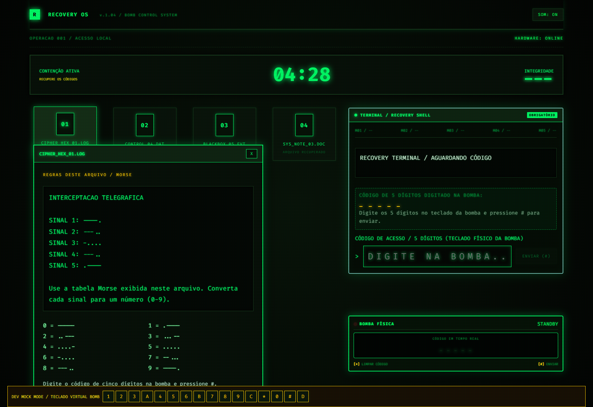
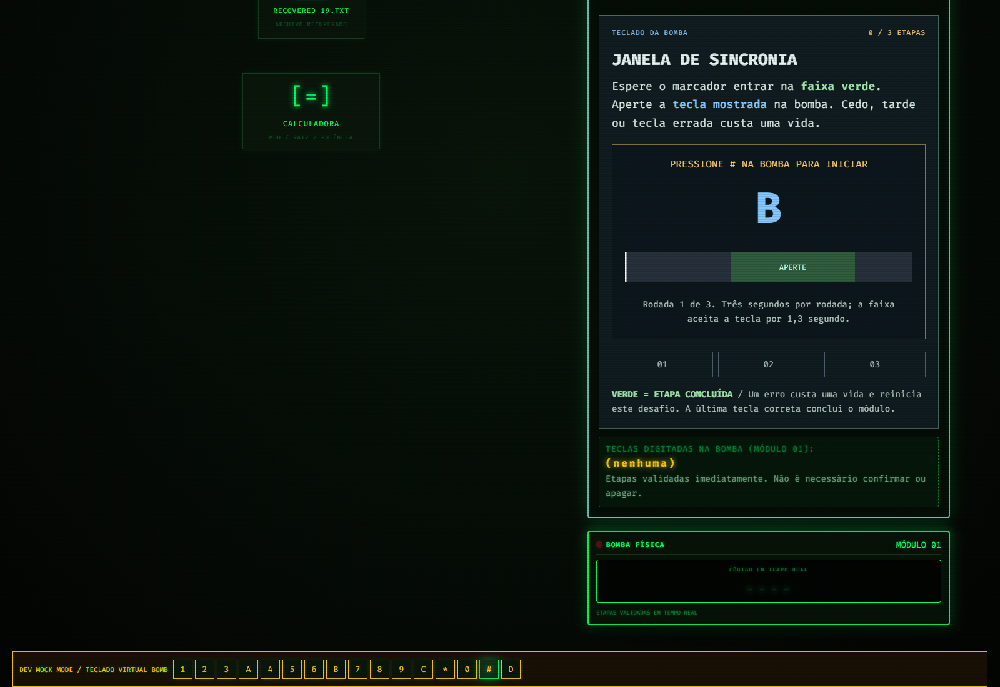
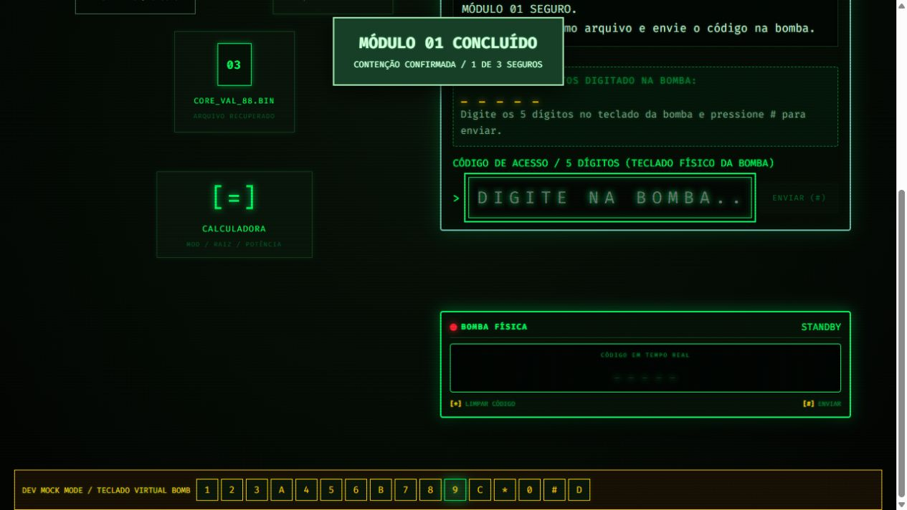
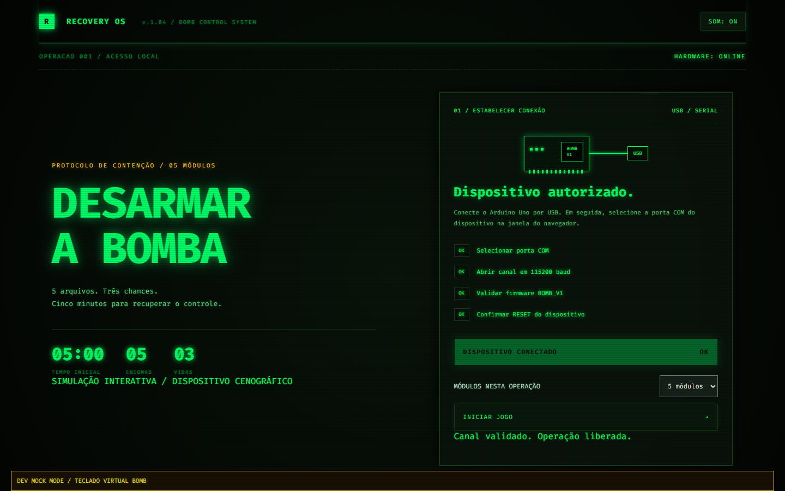
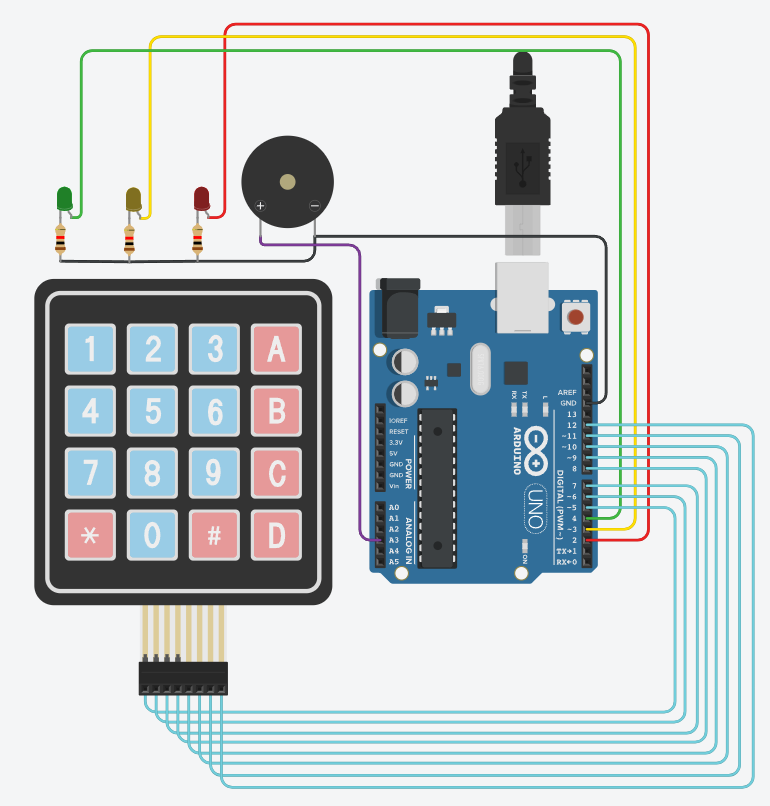

# Bomb Defusal Game

A browser puzzle game controlled by an Arduino Uno. Decode files on a CRT-inspired desktop, then complete timed challenges with a physical 4×4 keypad. The device is a theatrical prop; it contains no explosives.

The browser verifies the Arduino connection before it enables **Start Game**. A development-only mock mode lets you explore the interface without hardware.

## Gameplay screenshots

<table align="center">
  <tr><th>Decode a recovered file</th><th>Follow the wire sequence</th></tr>
  <tr>
    <td align="center"><a href="docs/images/morse-puzzle.png"></a></td>
    <td align="center"><a href="docs/images/wire-cutting.jpg"></a></td>
  </tr>
  <tr><td align="center">Morse puzzle and code terminal</td><td align="center">Selective wire-cutting challenge</td></tr>
</table>

<table align="center">
  <tr><th>React at the right moment</th><th>Secure a module</th></tr>
  <tr>
    <td align="center"><a href="docs/images/synchronization-game.png"></a></td>
    <td align="center"><a href="docs/images/module-complete.jpg"></a></td>
  </tr>
  <tr><td align="center">Synchronization challenge</td><td align="center">Module completion feedback</td></tr>
</table>

Screenshots use the development mock keypad. In normal play, challenge input comes from the Arduino keypad.

## What you need

- Node.js 22 and npm
- Desktop Chrome or Edge with Web Serial support
- Arduino Uno, a USB data cable, a 4×4 matrix keypad, three LEDs, three suitable current-limiting resistors, and a buzzer
- Arduino IDE to upload [`bomb_controller.ino`](arduino/bomb_controller/bomb_controller.ino)

Web Serial requires `localhost` or HTTPS. Close the Arduino Serial Monitor before connecting in the browser; both cannot use the same serial port at once.

## Get started

1. Wire the components using the [firmware pin map](#wiring). The supplied illustration uses different pins, so check the table first.
2. Open `arduino/bomb_controller/bomb_controller.ino` in Arduino IDE. Select **Arduino Uno** and the correct port, then upload. No extra Arduino libraries are required.
3. Start the web app:

   ```powershell
   npm ci
   npm run dev
   ```

4. Open the URL printed by Vite. Click **Connect Device**, select the Arduino port, then choose **Start Game**.

The app opens the serial port at **115200 baud**, waits for `READY|BOMB_V1`, sends `RESET`, and requires `ACK|RESET`. Start Game stays disabled until that handshake finishes. The port picker belongs to the browser and cannot be replaced or auto-selected by the app.

<p align="center"><a href="docs/images/connection.png"></a></p>

*Setup screen captured in development mock mode; it does not prove a physical Arduino connection.*

### Explore without hardware

Run the development server and open `http://127.0.0.1:5173/?mock=1` (use the port printed by Vite if it differs). The **DEV MOCK MODE** bar provides a virtual keypad. Mock mode is disabled in production builds.

## Wiring

The [prototype photo](docs/images/prototype.jpeg) shows the Uno, keypad, and three LEDs used for the game.

<p align="center"><a href="docs/images/prototype.jpeg"></a></p>

**Use this pin map with the firmware in this repository:**

<table align="center">
  <tr><th>Arduino pin</th><th>Connection</th></tr>
  <tr><td>D7, D8, D9, D10</td><td>Keypad rows 1–4, in order</td></tr>
  <tr><td>D3, D4, D5, D6</td><td>Keypad columns 1–4, in order</td></tr>
  <tr><td>A0</td><td>Yellow LED</td></tr>
  <tr><td>A1</td><td>Green LED</td></tr>
  <tr><td>A2</td><td>Red LED</td></tr>
  <tr><td>A3</td><td>Buzzer positive terminal</td></tr>
  <tr><td>GND</td><td>LED circuits and buzzer negative terminal</td></tr>
</table>

Put one suitable current-limiting resistor in series with **each** LED and observe LED polarity. Check your keypad's row and column terminal order; it varies by model. If necessary, change `ROW_PINS` and `COL_PINS` near the top of the firmware. The expected layout is `123A / 456B / 789C / *0#D`. Leave D0 and D1 free for USB serial.

### Tinkercad circuit diagram

> **Pinout difference:** this Tinkercad image shows the components, but its Arduino pin connections differ from the current firmware. Use the table above when wiring this version of the project.

<p align="center"><a href="docs/images/wiring-reference.png"></a></p>

Check polarity, resistors, and shorts before connecting USB. The prototype photo and mock screenshots do not verify the wiring of another build.

## How to play

1. Choose **3, 5, or 7 modules** (default: 5). The game draws distinct puzzle families for each operation.
2. Read each recovered file, solve its five-digit code, and enter the code on the physical keypad. `*` clears the entry; `#` submits it.
3. Complete the module's physical-keypad challenge. Its rules appear in the challenge panel.
4. After all modules are secure, press `#` on the keypad to finish.

An operation starts with **three lives and five minutes**. A wrong answer costs a life and restarts the current challenge. The timer starts only after the Arduino acknowledges `START`; errors can accelerate it. A lost serial connection stops the operation, which cannot be resumed.

Puzzle families include colors, binary switches, vault dials, Caesar cipher, mirrored text, Morse code, and binary conversion. Physical challenges include selective wire cutting, pulse memory, circuit routing, synchronization, reversed echo, reactor arithmetic, and symbol decoding. Every operation includes the synchronization challenge.

The desktop calculator supports arithmetic, `mod`, powers, roots, common math functions, and parentheses. The computer keyboard controls the calculator; normal gameplay answers come from the serial keypad.

## Build and project layout

```powershell
npm run build
```

This checks TypeScript and writes a production build to `dist/`. Serve that directory from `localhost` or HTTPS for Web Serial access.

<table align="center">
  <tr><th>Path</th><th>Purpose</th></tr>
  <tr><td><code>arduino/bomb_controller/bomb_controller.ino</code></td><td>Keypad scanning, LEDs, buzzer, and serial commands</td></tr>
  <tr><td><code>src/game.ts</code></td><td>Puzzle generation and game rules</td></tr>
  <tr><td><code>src/minigames.ts</code> and <code>src/PhysicalMiniGame.tsx</code></td><td>Physical challenges and their interface</td></tr>
  <tr><td><code>src/serial.ts</code></td><td>Browser–Arduino communication</td></tr>
  <tr><td><code>src/style.css</code></td><td>CRT-inspired visual design</td></tr>
</table>

### Serial protocol

Messages are UTF-8 lines terminated by a newline. The Arduino sends `READY|BOMB_V1`, `KEY|<key>`, `ACK|RESET`, `ACK|START`, and `PONG`. The web app sends `RESET`, `START`, `LIVES|0` through `LIVES|3`, `BUZZ|NORMAL`/`ALERT`/`FAST`/`CRITICAL`, `EVENT|ERROR`, `EVENT|SUCCESS`, `DEFUSED`, `EXPLODE`, and `PING`.

## Troubleshooting

<table align="center">
  <tr><th>Symptom</th><th>Check</th></tr>
  <tr><td>Port is busy</td><td>Close Arduino Serial Monitor and other tabs using the port.</td></tr>
  <tr><td>No port appears</td><td>Check the USB data cable, driver, and physical connection.</td></tr>
  <tr><td>No <code>READY|BOMB_V1</code></td><td>Confirm the uploaded firmware and 115200 baud; reconnect the Uno.</td></tr>
  <tr><td>Port selection was canceled</td><td>Click <strong>Connect Device</strong> and choose the port again.</td></tr>
  <tr><td>Web Serial is unavailable</td><td>Use desktop Chrome or Edge on <code>localhost</code> or HTTPS.</td></tr>
</table>

The browser mock and build verify software behavior only. Physical keypad, LED, and buzzer behavior require a connected Arduino build.
